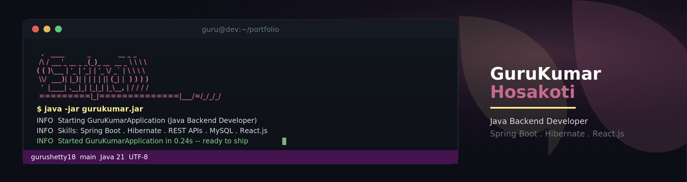

<!-- Banner -->
<p align="center">
  
</p>

<!-- Header -->
<div align="center">

#  Hi, I'm GuruKumar Hosakoti!

### Java Developer • Backend Developer • Java Full Stack Developer
**Spring Boot • Hibernate • React.js**

<p>
  <a href="https://github.com/gurushetty18">
    
  </a>

  <a href="https://www.linkedin.com/in/gurukumar-hosakoti-2a0070281/">
    
  </a>

  <a href="https://gurushetty18.github.io/guru.github.io">
    
  </a>

  <a href="mailto:gurushetty018@gmail.com">
    
  </a>

  <a href="https://www.instagram.com/shetty18__/">
    
  </a>
</p>

<p>
  
</p>

</div>

---

<!-- Start Intro -->

<div>
  
</div>

## 👨‍💻 About Me

I am a **Java Developer / Backend Developer / Java Full Stack Developer** with hands-on experience building web applications using **Java, Spring Boot, Spring MVC, Spring Data JPA, Hibernate, RESTful APIs, MySQL, and React.js**.

- 🎯 Passionate about backend development and building real-world applications
- 💻 Experienced with Java, Spring Boot, Spring MVC, Hibernate, JPA and REST APIs
- 🌱 Currently strengthening my knowledge of **Spring Security, JWT Authentication, Microservices, Docker, AWS, and System Design**
- 💡 Strong foundation in **OOP, DSA, SQL, MVC Architecture, and Database Management**
- 🤝 Familiar with **Agile/Scrum, Jira, Git, GitHub, and Bitbucket**
- 🤖 Experienced with AI-assisted development tools such as **Claude, GitHub Copilot, Google Gemini, and Antigravity**
- 🚀 Interested in developing scalable and practical web applications
- 📄 **[Download My Resume](./GuruKumar_Hosakoti_Resume.pdf)**
- 🌐 **[Visit My Portfolio](https://gurushetty18.github.io/guru.github.io)**

<br clear="right"/>

---

<!-- Languages and Tools Section -->

<h2 align="center">🛠️ Tᴇᴄʜ Sᴛᴀᴄᴋ & Cᴜʀʀᴇɴᴛ Lᴇᴀʀɴɪɴɢ</h2>

<picture>
  <source media="(prefers-color-scheme: dark)" srcset="./Skills_Animation_Dark.gif">
  <source media="(prefers-color-scheme: light)" srcset="./Skills_Animation_White.gif">
  
</picture>

<br />

### ☕ Backend & Java

- Java
- Spring Boot
- Spring MVC
- Spring Security
- Spring Data JPA
- Hibernate ORM
- JDBC
- RESTful Web Services
- Microservices Architecture

### 🎨 Frontend

- React.js
- JavaScript
- HTML5
- CSS3
- Bootstrap
- Thymeleaf
- JSP

### 🗄️ Database

- MySQL
- SQL
- RDBMS
- Database Normalization
- MySQL Workbench

### 🔧 Developer Tools

- Git
- GitHub
- Bitbucket
- Maven
- Postman
- Eclipse
- VS Code
- Jira
- Agile / Scrum

### 🤖 AI-Assisted Development

- Claude
- GitHub Copilot
- Google Gemini
- Antigravity

### 📚 Current Learning

- Spring Security & JWT Authentication
- Microservices
- Docker
- AWS
- System Design
- Advanced React.js
- Scalable REST APIs

---

<!-- GitHub Trophies -->

<h2 align="center">🏆 Gɪᴛʜᴜʙ Tʀᴏᴘʜɪᴇs 🏆</h2>

<p align="center">

  <a href="https://github.com/gurushetty18">

    <picture>

      <source
        media="(prefers-color-scheme: dark)"
        srcset="https://github-profile-trophy-ruddy.vercel.app/?username=gurushetty18&no-bg=true&row=2&column=6&margin-w=20&margin-h=20&theme=monokai">

      <source
        media="(prefers-color-scheme: light)"
        srcset="https://github-profile-trophy-ruddy.vercel.app/?username=gurushetty18&no-bg=true&row=2&column=6&margin-w=20&margin-h=20">

      

    </picture>

  </a>

</p>

---

<!-- GitHub Stats -->

<h2 align="center">📊 Gɪᴛʜᴜʙ Sᴛᴀᴛs 📊</h2>

<table width="100%">

<tr>

<td width="50%">

<h3 align="center">
<strong>Gɪᴛʜᴜʙ Sᴛᴀᴛs</strong>
</h3>

<p align="center">

<a href="https://github.com/gurushetty18">


</a>

</p>

</td>

<td width="50%">

<h3 align="center">
<strong>Sᴛʀᴇᴀᴋ Sᴛᴀᴛs</strong>
</h3>

<p align="center">

<a href="https://github.com/gurushetty18">


</a>

</p>

</td>

</tr>

<tr>

<td width="50%">

<h3 align="center">
<strong>Gɪᴛʜᴜʙ Pʀᴏғɪʟᴇ</strong>
</h3>

<p align="center">

<a href="https://github.com/gurushetty18">


</a>

</p>

</td>

<td width="50%">

<h3 align="center">
<strong>Tᴏᴘ Cᴏɴᴛʀɪʙᴜᴛɪᴏɴs</strong>
</h3>

<p align="center">

<a href="https://github.com/gurushetty18">


</a>

</p>

</td>

</tr>

</table>

---

<!-- Contribution Graph -->

<h2 align="center">📈 Cᴏɴᴛʀɪʙᴜᴛɪᴏɴ Gʀᴀᴘʜ 📈</h2>

<div align="center">


</div>

---

<!-- Featured Projects -->

<h2 align="center">🚀 Fᴇᴀᴛᴜʀᴇᴅ Pʀᴏᴊᴇᴄᴛs</h2>

<table width="100%">

<tr>

<td width="50%" valign="top">

### 🩸 Blood Donation & Hospital Request System

**Spring Boot • Spring Security • Twilio SDK • TwiML • Spring Data JPA • Thymeleaf • MySQL • Bootstrap**

- 🏥 Connects hospitals with blood donors
- 🩸 Hospitals can post blood requests
- 🤝 Donors can manage pledges
- 📊 Tracks donation fulfillment status
- 📞 Integrated Twilio Voice API and TwiML for Click-to-Call
- 🔐 Implemented role-based authentication and route authorization
- 🗄️ Designed relational entities using JPA/Hibernate and custom repository queries

</td>

<td width="50%" valign="top">

### 🎓 Student Attendance Management System

**Spring Boot • Spring Data JPA • Hibernate • Thymeleaf • MySQL • Bootstrap**

- 👨‍🎓 Student management and registration
- 📝 Daily attendance tracking
- 📅 Attendance history
- 📊 Monthly attendance percentage reports
- 🔄 CRUD operations
- 🔗 One-to-Many entity relationships
- 🖼️ Student profile photo upload using MultipartFile
- 📱 Responsive Thymeleaf + Bootstrap interface

</td>

</tr>

<tr>

<td width="50%" valign="top">

### 🔐 AES Cryptography & LSB Steganography

**Java • AES Encryption • LSB Steganography**

- 🔒 AES encryption and decryption
- 🖼️ Secure information hiding inside digital images
- 📥 Data embedding and extraction
- 🛡️ Designed for confidential data transfer
- 💻 Simple interface for encryption/decryption workflows

</td>

<td width="50%" valign="top">

### 💡 Java Full Stack Development

**Java • Spring Boot • Spring MVC • Hibernate • MySQL • React.js**

- REST API development
- Backend business logic
- Database operations
- CRUD functionality
- MVC architecture
- Frontend and backend integration
- Exception handling and API integration

</td>

</tr>

</table>

---

<!-- Learning -->

<h2 align="center">🌱 Wʜᴀᴛ I'ᴍ Lᴇᴀʀɴɪɴɢ</h2>

```java
class GuruKumar {

    String[] learning = {
        "Spring Security",
        "JWT Authentication",
        "Microservices",
        "Docker",
        "AWS",
        "System Design",
        "Advanced React.js",
        "Scalable REST APIs"
    };

    String[] developmentTools = {
        "Claude",
        "GitHub Copilot",
        "Google Gemini",
        "Antigravity"
    };
}
